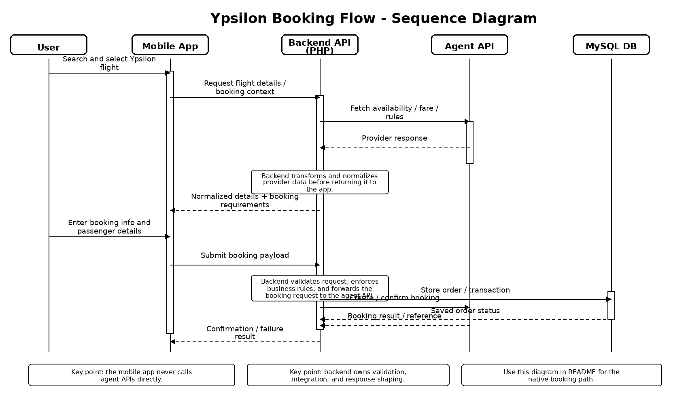
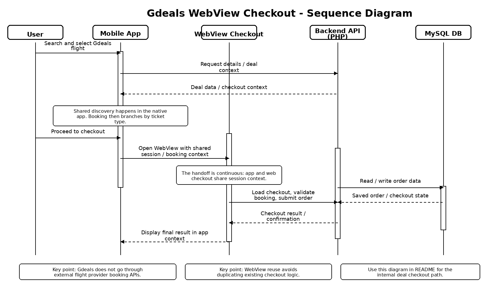

# Flight Booking Mobile App

> 📱 Production-grade mobile application for flight search and booking,
> supporting mixed inventory (internal deals + agent tickets),
> hybrid booking flows (WebView + native),
> and integration with a legacy backend system.

------------------------------------------------------------------------

## 🚀 Overview

This project is a **production flight booking application** built for a real travel business (name anonymized), designed to handle mixed ticket inventory and multiple booking models.

The app combines:

- unified flight search across internal deals and agent-provided tickets  
- hybrid booking architecture (WebView checkout + native booking flow)  
- integration with a legacy backend system (PHP + MySQL)  
- multi-step passenger and booking management  

It was built to support real transaction flows while maintaining consistency with an existing web platform.

------------------------------------------------------------------------

## ✈️ Features

- 🔍 Unified flight search across multiple inventory sources  
- 💰 Mixed results combining internal deals and agent-provided tickets  
- 🔀 Dynamic flow branching based on ticket type  
- 🧾 Hybrid booking flows (WebView checkout + native multi-step flow)  
- 👤 Structured passenger management with validation  
- 📦 Order creation, confirmation, and tracking 

------------------------------------------------------------------------

## 🔄 User Flow

Search → Results → Details → (Branch by ticket type)

- Internal Deals → WebView Checkout (reuses existing backend-driven flow)  
- Agent Tickets → Native Booking Flow (backend-mediated API integration) 

------------------------------------------------------------------------

## 🔀 Booking Flow Overview

- Unified search experience across mixed inventory (internal deals + agent tickets)  
- Booking flow branches at the detail stage based on ticket type:

  - Internal Deals → WebView Checkout (reuses existing web-based booking system)  
  - Agent Tickets → Native Booking Flow (backend-mediated API integration) 

------------------------------------------------------------------------

## 🧩 Booking Architecture

### Shared Discovery Flow

`flightresults → flightdetails`

- Results include both internal deals and agent-backed tickets  
- Branching occurs at the detail screen  

---

### 1. Internal Deal Flow

`flightresults → flightdetails → webview checkout`

- Native browsing experience  
- Checkout handled via WebView  
- Shared session between app and web  
- Uses existing backend + database  

---

### 2. Agent API Flow

`flightresults → flightdetails → flightbooking → flightpassenger → flightconfirm`

- Fully native booking experience  
- App communicates with backend  
- Backend communicates with agent APIs  
- Multi-step validation and passenger input  

------------------------------------------------------------------------

## 🔁 Sequence Diagrams

These diagrams illustrate the runtime behavior of each booking path.

### Agent API Flow

  

### WebView Checkout Flow

  

------------------------------------------------------------------------

## 🔄 Data Flow (Agent Booking Example)

1. User selects flight → app creates booking payload and context  
2. App sends request → backend API  
3. Backend:
   - validates request and booking state  
   - orchestrates call to external agent API  
   - transforms and normalizes provider responses  

4. Normalized data returned → app updates booking flow  
5. Backend persists order and transaction data  
6. Confirmation (or failure) returned → UI updated  

------------------------------------------------------------------------

## 🧠 Key Design Decisions

### WebView vs Native Checkout

- Reused existing web checkout to avoid duplicating complex business logic  
- Ensured consistency with the existing web platform  
- Reduced development time and integration risk  
- Avoided re-implementing payment and validation flows in mobile  

### Backend-Mediated API Integration

- Prevented direct client-to-provider communication  
- Centralized provider integration, validation, and error handling  
- Improved security and control over external API usage  
- Enabled consistent response shaping across different providers  

### Branching Architecture

- Unified search experience across mixed inventory  
- Deferred complexity to the detail stage to simplify discovery  
- Allowed different booking strategies without affecting search UX  

------------------------------------------------------------------------

## ⚠️ Engineering Challenges

### Mixed Inventory Handling

- Unified UI across internal deals and agent-provided tickets  
- Handled inconsistent data structures (e.g. pricing, baggage, segments) across providers  
- Preserved different downstream booking behaviors while keeping a single search experience  

### Flow Branching

- Implemented conditional navigation and state management based on ticket type  
- Ensured booking state consistency across divergent multi-step flows  

### Hybrid Web + Native Checkout

- Maintained session continuity between native app and WebView  
- Ensured seamless transition without requiring re-authentication or data loss  

### Backend-Mediated APIs

- Routed all provider communication through backend  
- Centralized validation, transformation, and error handling  
- Prevented tight coupling between mobile app and external APIs  

------------------------------------------------------------------------

## ⚠️ Failure Handling

- Prevented duplicate booking submissions using request locking / submission guards  
- Handled API failures with retry strategies and clear user-facing error states  
- Preserved booking state across navigation steps and partial progress  
- Managed partial failures (e.g. validation success but booking failure) with recoverable flows 

------------------------------------------------------------------------

## 📊 Production Considerations

- Designed for real booking transactions with multi-step validation  
- Managed API latency with loading states and progressive feedback  
- Ensured consistency with existing web platform behavior  
- Balanced user experience with backend constraints and response times  

------------------------------------------------------------------------

## 🔧 Future Improvements

- Introduce a BFF (Backend-for-Frontend) layer for mobile-specific optimization  
- Add caching strategy for search results to reduce repeated API calls  
- Improve analytics tracking for booking funnel and drop-off points  
- Add offline handling for partial flows and retry scenarios  

------------------------------------------------------------------------

## 🔍 Retrospective

- Would introduce a BFF layer earlier to simplify frontend logic  
- Would standardize backend response formats to reduce normalization complexity  
- Would reduce reliance on frontend data transformation by shifting logic to backend  

------------------------------------------------------------------------

## ⚠️ Notes

- This repository focuses on frontend architecture and system design  
- Backend implementation and third-party integrations are not included  
- All sensitive business logic and data have been removed or anonymized  

------------------------------------------------------------------------

## 👤 Author

Mobile engineer focused on building production applications with:

- React Native (Expo)  
- Firebase integration  
- Transactional / booking systems  
- Integration with legacy backend architectures  

Experience includes designing hybrid mobile architectures, handling mixed inventory systems, and integrating with external APIs through backend services.

