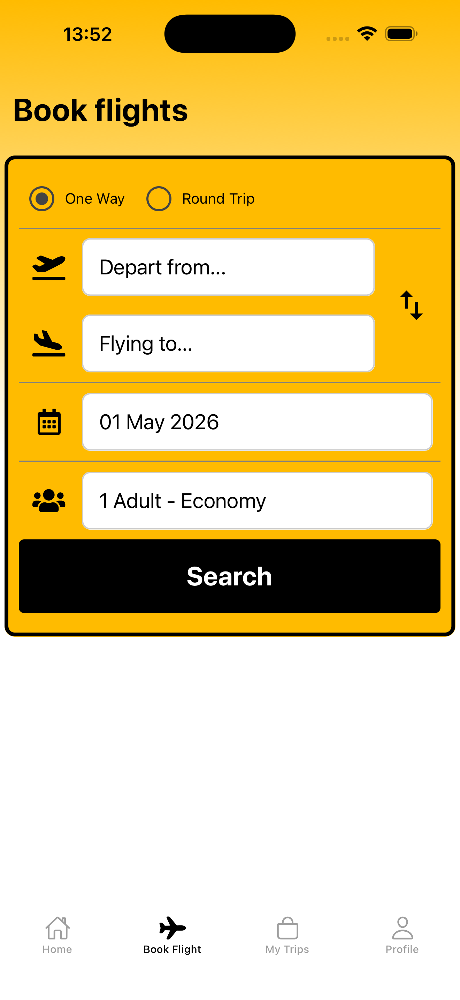
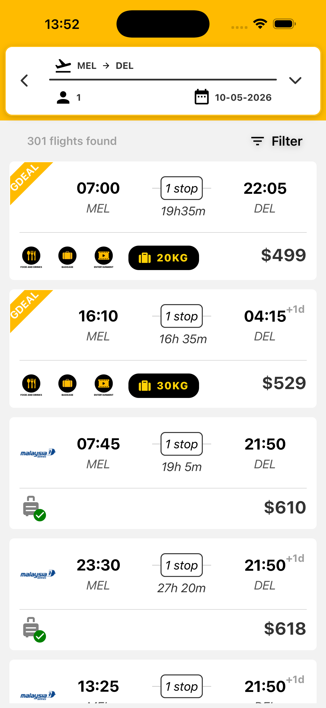

# Flight Booking Mobile App

> 📱 A production mobile application for flight search and booking, built with React Native and integrated with an existing backend system.

---

## 🚀 Overview

This project is a **mobile flight booking application** designed for a real-world travel business (name anonymized for confidentiality).

The app supports:

- flight search  
- price-based result listing  
- booking flow  
- passenger management  
- order tracking  

It integrates with an existing backend system to handle flight data, bookings, and payments.

---

## ✈️ Features

- 🔍 Flight search (origin, destination, date, passengers)  
- 💰 Sorted flight results (price-based)  
- 📄 Flight details (layovers, baggage, airline info)  
- 🧾 Multi-step booking flow  
- 👤 Passenger management (adults, children, infants)  
- 📦 Order history and tracking  

---

## 🔄 User Flow

Search → Results → Details → Booking → Passenger → Confirmation

- Users can browse flights without logging in  
- Authentication is required before completing a booking  
- Booking flow follows validation + step-based input  

---

## ⚙️ Tech Stack

### Frontend
- React Native (Expo)
- Expo Router
- Expo Notifications

### Backend (External System)
- PHP-based backend (existing system)
- MySQL database
- Shared with web platform

### Authentication & Analytics
- Firebase Authentication (Email, Phone, Google, Apple)
- Google Analytics

### Build & Deployment
- Expo EAS Build

---

## 📱 Screenshots

  
  

---

## 🧠 Technical Highlights

### 1. Unified Flight Data Handling

- Integrated multiple flight data sources:
  - internal fixed-price deals  
  - external agent APIs  

- Normalized different data formats into a unified structure for frontend rendering  

---

### 2. Booking Flow Integration

- Implemented mobile flow aligned with existing web booking system  
- Ensured compatibility with backend validation and session logic  
- Maintained consistency between mobile and web experiences  

---

### 3. Authentication Strategy

- Login is optional for browsing (App Store requirement)  
- Required before booking  
- Firebase Auth used for session handling  
- User data synced to backend for analytics  

---

### 4. Environment Management

- Separate environments for development and production  
- .env-based configuration  
- EAS build profiles for different stages  

---

## ⚠️ Notes

- This repository contains **architecture and implementation overview only**  
- Backend system details are not included  
- All sensitive business data has been removed or anonymized  

---

## 👤 Author

Mobile engineer with experience building:

- production mobile applications  
- booking and transactional systems  
- React Native + Firebase apps  
- real-world integrations with legacy backend systems  
